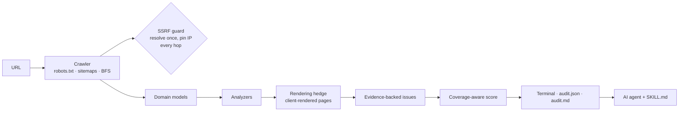

# Web Visibility Skill

> An engineering-grade Agent Skill for auditing and improving website visibility
> across search engines, answer engines, and generative AI systems.

**Phase 01: technical foundation (v0.2.0, hardened).** A deterministic, bounded
crawler with **65 evidence-backed technical checks plus 17 informational notes**,
a coverage-aware diagnostic score, and an Agent Skill that teaches AI coding
agents (Claude Code, Codex, Cursor, …) how to use them.

> **This is not a ranking prediction engine and does not guarantee search or
> generative-engine visibility.** It reports observable technical conditions in
> server responses, with evidence and an explicit statement of what it could
> not check.


---

## Why this exists

Ask an LLM to "audit my SEO" and it will often guess. It may assume a canonical
is missing, call a 403 a broken link, or promise ranking gains. This project
splits the work:

| Deterministic tooling (this repo) | Agent intelligence (via `SKILL.md`) |
|---|---|
| Does robots.txt block Googlebot? Which rule decides it? | Is that block intentional (staging) or a launch blocker? |
| Which internal links return 404? | Which should be fixed first, and in which template? |
| Which pages share a title? | Template bug or intentional? |
| Is the server HTML an empty JavaScript shell? | Does the site need server-side rendering for its goals? |

The tool's guiding rule: **a smaller audit with honest findings beats a large one
that is confidently wrong.** When it cannot check something, it says so (N/A,
reduced confidence, `partial` audit state) instead of awarding points.

## Architecture



Details: [docs/architecture.md](docs/architecture.md).

## Features

- **Crawler**: same-origin, 20-page default, honest User-Agent, robots.txt obeyed,
  `Crawl-delay` and `Retry-After` honoured, same-host redirects of the start URL
  (http → https, apex ↔ `www`) adopted.
- **robots.txt, per crawler**: verdicts for Googlebot, Bingbot, GPTBot,
  OAI-SearchBot, ClaudeBot, PerplexityBot, Google-Extended and CCBot, each with
  the deciding group and rule (RFC 9309 matching).
- **Indexability**: `robots`, `googlebot` and `bingbot` meta tags, and
  agent-scoped `X-Robots-Tag` headers.
- **Sitemaps**: declared (robots.txt, indexes) vs guessed (`/sitemap.xml`),
  completeness tracking, gzip and plain text, safe XML parsing.
- **Canonicals**: HTML `<head>` and HTTP `Link` header, with placement checks
  (body or implicitly closed head).
- **HTTP**: status codes, redirect chains, HTTPS, mixed content, linked error pages.
- **Rendering**: multi-signal detection of client-rendered application shells.
- **Metadata, headings, links, images, JSON-LD**: see the
  [reference](.agents/skills/web-visibility/references/technical-seo.md).
- **Evidence model**: every issue has `evidence`, `affected_urls`, `severity`,
  `confidence`, `recommendation` and `verification`.
- **Outputs**: Rich terminal report, JSON (versioned schema 2.1), Markdown.

## Installation

Requires **Python 3.11+**. The package is not on PyPI.

**As a user** (installs the `web-visibility` command in its own environment):

```bash
pipx install git+https://github.com/luffy2769/web-visibility-skill@v0.2.0
web-visibility --version     # web-visibility 0.2.0 (report schema 2.1)
```

**For development**:

```bash
git clone https://github.com/luffy2769/web-visibility-skill
cd web-visibility-skill
python -m venv .venv && source .venv/bin/activate   # Windows: .venv\Scripts\activate
pip install -e ".[dev]"
```

## CLI usage

```bash
web-visibility audit https://example.com                     # terminal report
web-visibility audit https://example.com --max-pages 50      # bigger crawl
web-visibility audit https://example.com --output ./reports  # + reports/example.com/audit.{json,md}
web-visibility audit https://example.com --format json       # JSON on stdout
web-visibility audit http://localhost:3000 --allow-private-network   # local dev server
```

| Option | Default | Purpose |
|---|---|---|
| `--max-pages`, `-n` | 20 | Maximum pages to crawl (1–1000). |
| `--timeout` | 10 | Seconds for DNS, connect and each read (the total body deadline is 3×). |
| `--max-page-bytes` | 5000000 | Maximum *decompressed* page size. Larger pages are not analyzed. |
| `--output`, `-o` | none | Write `audit.json` and `audit.md` to `<dir>/<host>/`. |
| `--format`, `-f` | terminal | Print `terminal`, `json` or `markdown` to stdout. |
| `--quiet`, `-q` | off | No terminal report or progress. |
| `--delay` | 0.25 | Minimum seconds between requests (raised by robots.txt `Crawl-delay`). |
| `--max-link-checks` | 50 | Uncrawled internal link targets to verify. |
| `--check-external` | off | Also verify external links (up to 25). |
| `--ignore-robots` | off | Crawl disallowed URLs (sites you own only). |
| `--allow-private-network` | off | Allow localhost or private IPs (disables SSRF checks). |
| `--show-info` | off | Include informational notes in the terminal report. |

Exit codes: `0` an audit was produced (check `crawl.state` and `score.status`:
it may be partial) · `1` the crawl failed (nothing could be audited; reports still
explain why) · `2` invalid URL or option · `3` internal error (no report is written,
and any previous `audit.json`/`audit.md` for that host is removed first so a stale
report is never mistaken for this run).

## Example output

An audit of the bundled fixture site, which contains intentional defects:

```text
┌─ Web Visibility Diagnostic Score ────────────────────────────────────────────┐
│ URL       http://localhost:8000/                                             │
│ Pages     10 crawled, 7 audited                                              │
│ Audit     COMPLETE                                                           │
│ Score     82/100                                                             │
└──────────────────────────────────────────────────────────────────────────────┘
Category             │   Score │                      │         Coverage │ Top deduction
Technical SEO        │ 18.3/25 │ ███████████████░░░░░ │       10/10 URLs │ crawled-page-error
Metadata             │   14/20 │ ██████████████░░░░░░ │        7/7 pages │ duplicate-title
Headings / Structure │ 14.1/15 │ ███████████████████░ │        7/7 pages │ multiple-h1
Links                │ 17.2/20 │ █████████████████░░░ │ 8/8 link targets │ broken-internal-link
Images               │  9.1/10 │ ██████████████████░░ │       5/5 images │ image-missing-alt
Structured Data      │  9.4/10 │ ███████████████████░ │        7/7 pages │ invalid-json-ld
ROBOTS.TXT (per crawler)
Googlebot       │ search │  allowed  │ User-agent: * -> no matching rule
GPTBot          │ ai     │  allowed  │ User-agent: * -> no matching rule
...
ISSUES   3 high   6 medium   15 low   8 info
  [HIGH] Broken internal link  1 page(s)
          http://localhost:8000/contact.html returned HTTP 404; linked from 1 page: http://localhost:8000/.
  [HIGH] Missing page title  1 page(s)
  [MED]  Invalid JSON-LD block  1 page(s)
          block 1: invalid JSON: Illegal trailing comma before end of object (line 1, column 77)
  ...
```

When links cannot be checked, the category shows **N/A** with a reason, and the
score is marked partial. It never reports a silent 20/20, and a link target that
answered 403/429 or timed out is *unverifiable*, never "checked":

```text
Links                │     N/A │ not scored │ 0/30 link targets │ link validation was not performed
```

## JSON example (schema 2.1)

```json
{
  "schema_version": "2.1",
  "crawl": { "state": "complete", "state_reasons": [], "site_url": "https://www.example.com/" },
  "score": {
    "name": "Web Visibility Diagnostic Score",
    "status": "complete",
    "overall": 82,
    "categories": {
      "links": {
        "score": 17.2, "max": 20,
        "coverage": { "status": "scored", "unit": "link targets", "applicable": 8, "checked": 8, "failed": 2 },
        "deductions": [{ "rule_id": "broken-internal-link", "severity": "high", "penalty": 0.0891, "points": 1.78 }]
      }
    }
  },
  "issues": [{
    "id": "broken-internal-link", "severity": "high", "confidence": 0.95,
    "evidence": "https://example.com/contact.html returned HTTP 404; linked from 1 page: ...",
    "affected_urls": ["https://example.com/"],
    "recommendation": "Update or remove links to this URL, or restore/redirect the missing page.",
    "verification": "Re-run the audit and confirm `broken-internal-link` is no longer reported for the affected URLs.",
    "details": { "target": "https://example.com/contact.html", "status": 404 }
  }],
  "robots": { "state": "parsed", "crawlers": [{ "crawler": "Googlebot", "root_allowed": true }] }
}
```

Full field reference and versioning policy: [docs/report-format.md](docs/report-format.md).

## How to read the results

### The diagnostic score

- Each category reports **coverage**: `scored` (all applicable items checked),
  `partial`, or `not-scored` (**N/A**).
- N/A categories are excluded from the overall score, which is normalized over
  the categories that were scored. The JSON reports `scored_weight` (out of 100).
- An issue costs `severity weight × confidence × prevalence` of its category
  (severity weights: critical 1.0, high 0.75, medium 0.4, low 0.15, info 0).
  Penalties accumulate, so 19 broken links out of 20 cost far more than one.
- **What could not be observed is never counted as checked.** Pages that failed
  to download, were refused (401/403/429, often bot protection), were too large or
  unparseable make the audit `partial` and are listed in `crawl.unretrieved`. A
  category where fewer items were measured than could not be measured (pages,
  client-rendered shells, unverifiable links) is N/A.
- If the scored categories carry less than half of the model (`scored_weight` <
  50), **no overall score** is computed (`score.status: insufficient-coverage`):
  for example a site whose bot protection refused every page but the first.
- A failed crawl (for example an unreachable site or an unavailable robots.txt)
  produces **no score** and an "incomplete audit" state, never a misleading number.

### robots.txt interpretation

Each crawler token is matched to its own `User-agent` group, or to `*` if none
names it. A `*` block with an explicit `Allow` for Googlebot is reported as
"Bingbot blocked", not "everything blocked". AI-crawler blocks are reported as
informational, because they are usually a policy choice. If robots.txt returns
5xx or 429 or cannot be reached, the auditor does **not** crawl (RFC 9309).

### Sitemap discovery

Sitemaps declared in robots.txt or sitemap indexes are authoritative.
`/sitemap.xml` is only a guess: if it returns a 404 or an HTML page (common with
SPAs), that is not reported as a defect. When the sitemap list could not be read
completely (limits reached, files failing), checks that need the full list are skipped.

## Known limitations

- **No JavaScript execution.** Client-rendered shells are *detected*, and their
  "missing content" findings carry reduced confidence (≤ 0.35), but the rendered
  page is not audited.
- **Only the crawled pages are analyzed** (20 by default). Orphan and duplicate
  detection are relative to that subset.
- **robots.txt**: a fixed list of crawler tokens is evaluated. Engine-specific
  fallbacks (e.g. `googlebot-image` → `googlebot`) are not modelled.
- **Canonical placement** detection approximates browser head-closing rules.
  Ambiguous cases are reported with confidence 0.5.
- **Structured data** is checked for JSON-LD syntax and `@type` only; Schema.org
  validation is Phase 02. Microdata and RDFa are detected but not parsed.
- **Same-site redirects**: only host changes involving `www.` (and scheme changes)
  are adopted, because no Public Suffix List is used. A start URL that redirects
  to another subdomain must be audited directly.
- **Not implemented**: content quality, GEO, AEO, entity analysis, backlinks,
  automated fixes, Search Console data.

## Security model

- **SSRF**: every request and redirect hop is resolved once (with a timeout),
  must resolve only to public addresses (IPv4 and IPv6, including embedded-IPv4
  forms), and is then sent to that **pinned** address. `--allow-private-network`
  turns this off for local development.
- **Decompression**: raw bytes are decompressed with a bounded output size. A
  200 MB gzip bomb peaks at about 3 MB of memory with a 1 MB limit.
- **XML**: `defusedxml` rejects DTDs, entity declarations and external references
  anywhere in the document.
- **Output**: terminal and Markdown escape all site-derived text, and `Set-Cookie`
  is redacted.

Full threat model and residual risks: [SECURITY.md](SECURITY.md).

## Agent Skill usage

The skill lives at [`.agents/skills/web-visibility/SKILL.md`](.agents/skills/web-visibility/SKILL.md),
follows the [Agent Skills](https://agentskills.io) format (frontmatter validated
in tests), and uses the **installed CLI** as its only execution interface.
It declares `requires-cli: >=0.2.0,<0.3.0` and `report-schema: 2`, and tells the
agent to check `web-visibility --version` and the report's `schema_version`
before interpreting anything. Copy the skill directory into your agent's skills
folder, install the CLI (see above), then ask:

> "Audit https://example.com for technical SEO issues and prioritize the top 10 fixes."

## Repository structure

```text
web-visibility-skill/
├── .agents/skills/web-visibility/   SKILL.md + references/technical-seo.md
├── src/web_visibility/
│   ├── cli.py  audit.py  config.py  # entry points and configuration
│   ├── crawler.py  fetch.py         # bounded crawl; the only network code
│   ├── safety.py  urls.py           # SSRF guard (resolve + pin); URL normalization
│   ├── parsing.py  robots.py  sitemap.py
│   ├── models/                      # page, issue, robots, sitemap, crawl (no crawler deps)
│   ├── analyzers/                   # technical, crawlability, metadata, headings, links, images, schema
│   ├── scoring.py                   # coverage-aware diagnostic score
│   └── reporters/                   # terminal, json_report, markdown_report
├── tests/
│   ├── unit/                        # module-level tests
│   ├── integration/                 # fixture site + audit #1 regressions (real pipeline)
│   ├── regression/                  # audit #2 findings and probe matrices (real sockets)
│   ├── security/                    # SSRF, bombs, hostile XML, ReDoS (real sockets)
│   ├── fixtures/                    # broken site, SPA shells
│   └── fake_site.py live_server.py fixture_server.py factories.py
├── scripts/mutation_check.py        # reverts each audit fix; the suite must catch every one
├── docs/   evals/   .github/workflows/ci.yml
```

## Development and testing

```bash
pip install -e ".[dev]"
ruff check src tests && ruff format --check src tests
mypy                     # strict
pytest                   # unit, integration, regression, security; no internet required
python scripts/mutation_check.py   # every audit fix, reverted, must fail the suite
```

- **Unit tests** cover each module, using `httpx.MockTransport` instead of the network.
- **Integration tests** run the real pipeline (controlled transport → crawler →
  parser → analyzers → scoring). They include a hand-reviewed *golden* finding set
  for the fixture site and one regression class per hardening finding (C1–L3).
- **CI** (`.github/workflows/ci.yml`, actions pinned to commit SHAs) runs lint,
  strict typing, tests on Python 3.11–3.14 (plus Windows and macOS), a coverage
  gate, and an installed-wheel audit of the fixture. *The workflow is validated
  locally (YAML, pinning and matrix tests); its execution on GitHub-hosted runners
  has not been verified yet.*

See [docs/development.md](docs/development.md) to add analyzers and tests.

## Roadmap

| Phase | Scope | Status |
|---|---|---|
| 01 | Technical foundation | ✅ v0.1.0, hardened in v0.2.0 |
| 02 | Advanced technical SEO + Schema.org validation | planned |
| 03 | Content SEO, internal-linking intelligence | planned |
| 04 | GEO: entity clarity, citation readiness | planned |
| 05 | AEO: answer structure | planned |
| 06 | Ethical authority / backlink research (no automation) | planned |
| 07 | Framework-aware implementation | planned |
| 08 | Before/after verification | planned |
| 09 | Agent evaluation framework | planned |
| 10 | CI/CD SEO regression testing | planned |

## Ethics

No keyword stuffing, cloaking, fake reviews, link schemes or spam automation.
The tool reports. It never submits, posts or contacts anyone.

## Contributing

Read [CONTRIBUTING.md](CONTRIBUTING.md). Every new check needs evidence, an
honest severity, a false-positive test, an end-to-end regression test, and
documentation in the reference.

## License

[MIT](LICENSE) © Raunak Rawat
