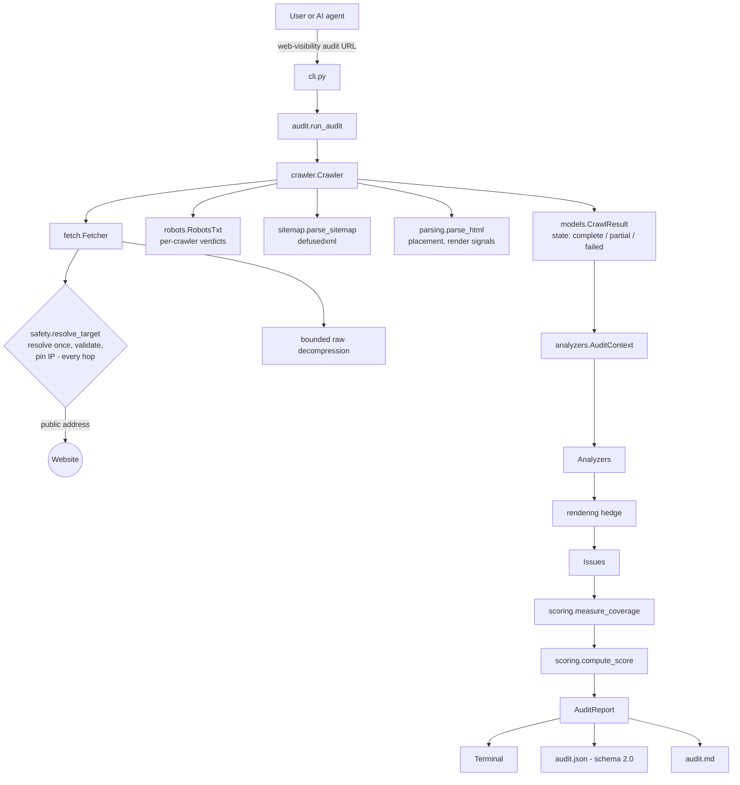

# Architecture

Phase 01 is a **deterministic auditing engine** plus an **Agent Skill** that
tells AI coding agents how to use it.

- **Scripts establish facts.** Does robots.txt block Googlebot? Does this link return 404?
- **Agents exercise judgement.** Which issues matter most here, and where is the fix?

No LLM is called anywhere in the engine. The same responses produce the same findings.



## Modules

| Module | Responsibility |
|---|---|
| `cli.py` | Typer CLI: options, progress on stderr, report files, exit codes. The only user-facing I/O. |
| `audit.py` | `run_audit()` / `build_report()`: crawl → analyze → coverage → score. No I/O. |
| `config.py` | `FetchConfig`, `CrawlConfig` (plain values, no dependencies). |
| `models/` | Domain models: `page` (Page, PageContent, CanonicalLink, robots directives), `issue` (Issue, Rule), `robots` (RobotsResult and states), `sitemap`, `crawl` (CrawlResult and state). **They do not depend on the crawler**, so future front ends (repository audits, report comparison) can build them directly. |
| `crawler.py` | Orchestrates robots.txt, start-URL resolution, sitemaps, the BFS crawl and link checks. |
| `fetch.py` | The only network code: pinned connections, manual redirects, bounded decompression, timeouts and deadline, throttling, Retry-After, header redaction. Errors are returned as data. |
| `safety.py` | SSRF guard: resolution with timeout, public-address validation (IPv4/IPv6, embedded IPv4). |
| `urls.py` | Conservative URL normalization; strict same-site test. |
| `parsing.py` | HTML → `PageContent`, including canonical placement, robots meta per agent, and rendering signals. |
| `robots.py` | RFC 9309 parser; per-crawler verdicts with the deciding rule; `Crawl-delay`. |
| `sitemap.py` | Sitemap parser (defusedxml, gzip limits, HTML detection). |
| `analyzers/` | One module per concern, each exposing `analyze(ctx)` and `RULES`. |
| `scoring.py` | Coverage measurement and the diagnostic score. |
| `reporters/` | Terminal, JSON and Markdown renderers, plus untrusted-text sanitizers. |

## Crawl sequence

1. **robots.txt** for the start origin, retried once after a transient network
   failure. States: `parsed`, `missing` (404/410/other 4xx → no restrictions),
   `inaccessible` (401/403 → no restrictions, reported), `rate-limited` (429),
   `server-error` (5xx), `unavailable` (network), `blocked` (SSRF guard). The last
   three non-blocked states mean **no crawling** (RFC 9309).
2. **Start URL**, fetched once (retried once on a transient error). If it
   redirects to the same host ignoring `www.` (http → https, apex ↔ www), that
   origin becomes `site_url` and its robots.txt replaces the first one.
3. **Crawl-delay** from the group applying to `WebVisibilitySkill` raises the
   request delay (up to `max_crawl_delay`, 30 s). Above that, only robots.txt and the start page are requested (no sitemaps, no link checks; the remaining link targets are listed as unchecked)
   (`stop_reason = crawl-delay-too-large`).
4. **Sitemaps**: robots.txt `Sitemap:` URLs (declared), sitemap-index children,
   and `/sitemap.xml` (a guess), up to 10 files and 50,000 URLs.
5. **Pages**: BFS over same-origin links, then same-origin sitemap URLs not yet
   seen (`discovered_via = sitemap`, which enables orphan detection). A 429 not
   resolved by `Retry-After` stops the crawl (`stop_reason = rate-limited`).
6. **Link checks**: link and canonical targets that were not crawled (including
   PDFs and images) are verified with HEAD, then GET on failure, within budget.

`CrawlResult.state` is `failed` when no page could be audited, and `partial` when
pages were left uncrawled, links went unchecked, the crawl stopped early,
transient errors occurred, the sitemap list was incomplete, or pages appear
client-rendered. `state_reasons` lists why.

## Analyzers and the rendering hedge

Analyzers are pure functions of `AuditContext` (audited pages, page index,
inlinks, `target_status()`, `link_coverage()`). After they run, `run_analyzers`
applies the **rendering hedge**: findings about *absent* content that JavaScript
could add (`RENDER_DEPENDENT_RULES`) are capped at confidence 0.35, flagged
`render_dependent`, and explained when every affected page (or, for site-wide
rules, any page) is a likely client-rendered shell.

## Issue model

```text
Issue
  id               stable kebab-case rule ID
  category         technical | metadata | structure | links | images | structured_data
  severity         critical | high | medium | low | info
  title / description / evidence (never empty) / recommendation
  verification     how to confirm the fix
  confidence       0..1
  affected_urls    where it was observed (empty = site-wide)
  details          machine-readable specifics
  prevalence       optional 0..1 scoring override
  impact / effort  optional 1..10; None unless an analyzer can justify them
                   (Phase 01 analyzers leave them None rather than guess)
```

## Scoring

The **Web Visibility Diagnostic Score** is an engineering diagnostic, not a
ranking prediction.

**Coverage first.** `measure_coverage()` records, per category, the unit, the
applicable items, the checked items, the failing items and a status:

| Category | Unit | `not-scored` when |
|---|---|---|
| Technical (25) | URLs | no page audited |
| Metadata (20), Structure (15), Structured Data (10) | pages | no page audited |
| Links (20) | link targets | **no target was checked** (`not-applicable` when there are no links) |
| Images (10) | images | `not-applicable` when there are no images on audited pages |

A category is `partial` when only some items were checked (pending pages,
unchecked links, client-rendered pages, early stop).

**Penalties.**

```text
issue_penalty   = severity_weight × confidence × prevalence
category_points = weight × (1 − min(1, Σ issue_penalty))        # scored/partial only
overall         = round(100 × Σ points / Σ weights of scored categories)

severity_weight: critical 1.0 · high 0.75 · medium 0.4 · low 0.15 · info 0
prevalence:      explicit when the analyzer knows the denominator
                 (broken target: 1 / checked targets; crawled-page-error: failing / crawled)
                 else affected pages ÷ audited pages, else 1 for site-level issues
```

Design decisions:

- **N/A is never 100%.** A category nobody could check is excluded and named,
  and `score.status` becomes `partial`.
- **No per-rule cap.** Earlier versions capped each rule at its severity weight,
  which let 19 broken links cost the same as one. Penalties now accumulate up
  to the category floor.
- **Escalation on catastrophic evidence.** `crawled-page-error` becomes critical
  when at least half the crawled pages fail. In the end-to-end test where 19 of
  20 pages return 404, the overall score lands well below a healthy site's,
  without being forced to 0.
- **No pages audited → no score** (`overall = null`, `status = not-scored`).

## Reporters

- **Terminal**: audit state, score with coverage column, per-crawler robots table,
  and issues. Untrusted text is sanitized and rendered as literal `Text`.
- **JSON**: the stable contract for agents (`docs/report-format.md`).
  `schema_version` follows major/minor rules.
- **Markdown**: a human report with all site-derived text escaped.

## Versioning

- Package: semantic versioning, pre-1.0. A minor bump may change the report
  incompatibly (0.1 → 0.2 did).
- Report: `schema_version` (`REPORT_SCHEMA_VERSION`). The major changes on
  renames, removals or changed meanings, and the minor on additions.
- Skill: `SKILL.md` metadata declares `requires-cli` and `report-schema`, and a
  test keeps them consistent with the package.

## Tests

- `tests/unit/`: module tests (HTTP via `httpx.MockTransport`).
- `tests/integration/test_fixture_audit.py`: the fixture site served over a
  real local HTTP server, with a hand-reviewed **golden** set of findings and scores.
- `tests/integration/test_hardening.py`: one class per audit finding (C1–L3) and
  a score sanity matrix, all through the real pipeline via `tests/fake_site.py`
  (raw streamed bodies, injected sleep).
- Static checks: SKILL.md manifest and compatibility, CI workflow (YAML, SHA
  pinning, Python matrix vs. classifiers), and invisible-character hygiene.

## Future architecture

| Phase | Extension point |
|---|---|
| 02 Structured data | Schema.org validation inside `analyzers/schema.py`. |
| 03 Content / linking | Content extraction in `parsing.py`; graph analysis on `AuditContext.inlinks`. |
| 04 GEO / 05 AEO | New analyzers and categories, added to `CATEGORY_WEIGHTS` only when implemented. |
| 07 Framework-aware | Repository scanners producing `models.Page` directly (`audit ./project`). |
| 08 Before/after | `compare before.json after.json` over the versioned schema. |
| 10 CI regression | Exit thresholds such as `--fail-on high`. |
